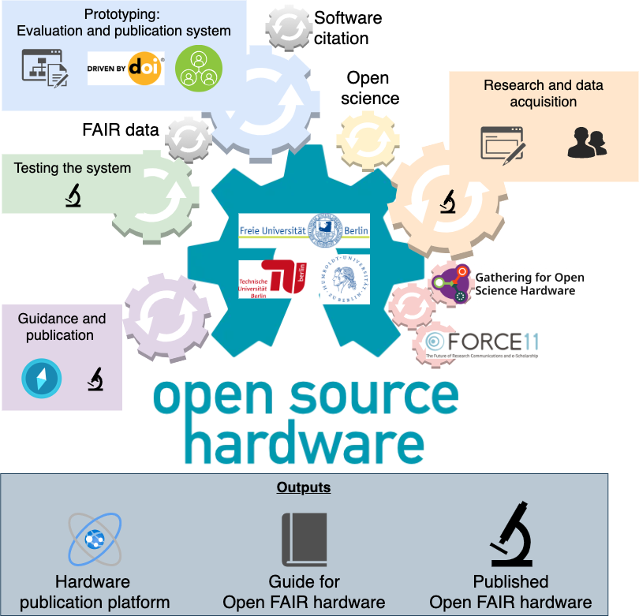

 # BUA grant discussion
 
 # title: Towards open and FAIR hardware.
 
 # Summary
 
We want to help researchers disseminate the hardware they are designing and get credit for that work, and do it efficiently; so they can focus on doing research. Setting up one's hardware is a common process in different research disciplines, even if it is rarely recognized as an important skill. However, there 
 is very few recommandation, certification or example for hardware documentation, which makes the transfer of knowledge difficult inside a lab and between labs. 
We want to build on the open next project experience and upon advances in software and data management (for instance applying the FAIR principles) to design 
 better workflows in hardware engineering in academia.
 
 

 After analysing processes researchers are using when their hardware get re-built, we will write recommendations and create a toolbox to help hardware builders to work more efficiently and more collaboratively. On the other hand, we will build a review system to assess the re-usability of hardware, making it possible to give a qualitative measure of the work quality and deriving a recognition sytem.
 
 
 # Problems to solve
  - Researchers and funding agencies have not developed sufficient mechanisms to evaluate technical documentation which makes it difficult to justify the necessary funding.
 - Researchers do not know how to document their hardware.
 - Researchers and technicians have no way to get recognition on their work as hardware engineers.
 - Researchers are spending too much time solving other people issue when dessiminating their hardware solutions.
 ~~- Researchers do not know where to find open hardware they could use.~~
 
 # Work packages
 
 ## WP1: analysis of existing workflow and infrastructures (line 2)
 
 - Search and define specific hardware piece that were well dessiminated in their community (buridan paradigm, airtrack system, and others), analyse the dessimination process.****
 - Design and run a Survey of researchers (cross domain) about their habits in production and dissemination of hardware, pain point, existing solutions.
 (done via lime survey provided by the HU CMS). Analyse answers and run comlete response via direct interviews.
 
 - Analyse resutls and refine our plan of WP2 and WP3 accordingly, especially look for a strategy to facilitate the adoption  of the developed workflow in the different communities.
 
 ##  WP2: Towards FAIR ~~and open source~~ hardware (line 1)
 
### Introduction

We want to propose a publication system for hardware. Our work will essentially be to create a novel and specific approach for academic hardware certification. On the other hand, we will build on the FAIR principles developed for data and on the software citation group outputs to integrate the certification system into an hardware publication system. We will Register and Archive the hardware documentation using workflows who have been used for software and data, while Awareness and rewards will be achieved using specific metadata schemes and indicating contribution roles in author lists. 

>A publication system aims: 
>- Registration 	...create a record of the works
>- Certification 	...have a way to judge the work’s quality
>- Awareness 	...make people aware of the work
>- Archiving 	...store the works for a long period of time
>- Rewarding 	...incentivize the production of scholarly work

 FAIR principles

- Findable: it has enough metadata to be indexed
- Accessible: a url/doi is enough to download the content, if one has rights to access it.
- Interoperable: it can used in combination with other hardware
- Reusable: the legallity and condition of its reuse is clearly stated
 
### Certification and peer review

#### Build the certification

Building on the [review system that is prototyped in the open next project](https://en.oho.wiki/wiki/Home), we will demonstrate how to review technical documentaion of FAIR and open source hardware created in the academic labs  or as prototypes in publicly funded research projects (using specific hardware defined in WP1).

We will define different level of certification, in order to lower the barrier for researchers to use that system. We will consider the creation of a badging system, that could be automatically added to the hardware documentation online.  NB:Interoperability of the hardware is part of the certification process and could be one specific certification level.
 
#### help reseacher document their hardware for the certification 

We will optimise the underlying review process and provide a guide and "standardised research hardware folder structure" (See GIN-Tonic project for data) to help researchers to prepare their hardware and its documentation for its peer review.

### FAIR hardware

 We will consider both the production of a DOI for a snapshot of the repository (via Zenodo, Dspace or GIN), 
 or the production of a paper similar to what JOSS is doing, or via a OJS system, as is developed in the [modern publishing project in Hamburg](https://oa-pub.hos.tuhh.de/en/). We will also consider the use of RRID as a PID, in order to facilitate hardware citation in the material and method section of a paper.
 
 In both approach specific metadata schema will be used to label these digital object as hardware documentation. We will work in collaboration with datacite to allow this (?).
 
  - license prescription: Cooperations on licensing issues for FAIR and open source data sharing will also be explored with relevant initiatives such as the [CERN OHL from the Open Hardware Repository](https://ohwr.org/project/cernohl/wikis/Documents/CERN-OHL-version-2/).

### Recognition and incentives:

In accordance with advances in software citation, we will prone the citation of the hardware itself, and not of a paper presenting it. This will make possible the creation of metrics specific to hardware citation. 

On the other hand, we will implement a contributor role taxonomy specific for hardware, in collaboration with CRO, the extension of the ([CREDIT](http://credit.niso.org/) taxonomy), to report the role of each author in a computer readable form, allowing for more specific recognition of hardware building and sharing skills.
 
### Prototyping the integration of hardware review in the publication system(s)

 
 We will extend the prototype mentioned above to be compatible with a publication workflow happening on a git-based platform. We will consider the possiblity to use 
 (1) the [JOSS infrastructure](joss.theoj.org/), where the review happens on the GitHub platform,
 (2) a Gitlab infrastructure,
 (3) a GIN-like infrastructure (https://gin.g-node.org/).
 
 The three tools use a similar wiki system, that would be compatible with the existing certification prototype. 
 Badging system are also common in these platforms.
 The development or application of a bot similar to the weadon bot used at JOSS or the Tonic bot used with GIN and gitlab will be created.

## WP3: Towards open source hardware (line 2)
  
Bring open science practice into hardware creation and publication projects:

   
### Building hardware collaboratively (as open source project):   
   - guide for collaboration rules, code of conducts, ways to make it more inclusive. Build on mozilla, open life science, OSMOOC prescriptions. Also built on the results of WP1.
   - application to ongoing project at the FU
   
   
### Communities and networks

Along the project, we will work in close collaboration with different players in open source, open hardware and open science.

- GOSH
- Force11 (software citation group WG, contributor attribution IG)
- datacite
- g-node, incf, NFDI-neuro
- Forster, EOSC
  

 
## expected outputs

- one or several hardware peer review and publication platform(s), probably decentralized.
- recommendation for building open FAIR hardware (updatable book)
- several published FAIR hardware (as examples: airtrack, robo-bee)

# Financial plan

Start: ASAP, for 2 years

- 42 T€: 1 TVL14 position 35 % for 2 years (HU: Julien Colomb), project coordination, publication system design, cooperation with international partners, supervision
- 72,5 T€: 1 TVL13 position 50% for 2 years (TU: Robert Mies), Hardware evaluation process/system + Recognition
- 54 T€: 1 TVL13 position 50% for 1.5 years (TU:, N.N.), Hardware evaluation process/system + Recognition
- 6 T€: 1 Student assistant 40h per months for two years (TU)
- 6 T€: 1 Student assistant 40h per months for two years (FU)
- 36 T€: 1 TVL13 position 50% for 1 years (HU), N.N., Hardware FAIRification
- 72,5 T€: 1 TVL13 position 50% for 2 years (FU, N.N.), Hardware FAIRification, software development
- 11 T€: publication costs, travel, workshops ?

 
